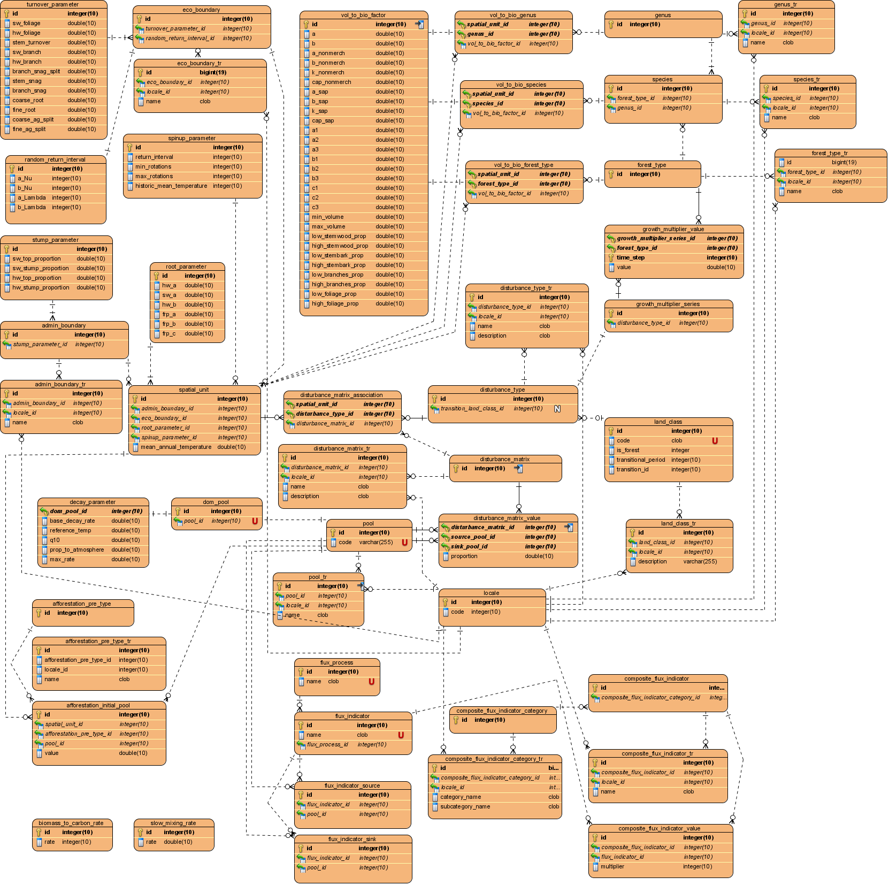

# cbm_defaults

This package creates a streamlined parameters sqlite database based mostly on the CBM-CFS3 parameters stored in the archive index format (AIDB).  The purpose of the streamlined database is to act as a component in the development of next generation models based on CBM-CFS3.

In addition to the default parameters in the AIDB this scrip will load several other [default tables](/tables) drawn from hardcoded values in the CBM-CFS3 source code among other places.

The database schema supports localization, and it can be configured to load localized strings, such as those found in the CBM-CFS3 model. 

## Schema

In addtion to this diagram, the schema can be viewed in text form [here](https://github.com/cat-cfs/cbm_defaults/blob/master/schema/cbmDefaults.ddl)



## Example usage

A command line app is included in this repository. The single parameter it uses is the path to a json formatted configuration file

See: [main.py](main.py), [app.py](cbm_defaults/app.py)

```
python main.py --config_path ./config.json
```

An example of the configuration format:
```json
    {
        "output_path": "cbm_defaults.db",
        "schema_path": "schema/cbmDefaults.ddl",
        "default_locale": "en-CA",
        "locales": [
            {"id": 1, "code": "en-CA"},
            {"id": 2, "code": "fr-CA"}
        ],
        "archive_index_data": [
            {"locale": "en-CA",
            "path": "ArchiveIndex_Beta_Install.mdb"},
            {"locale": "fr-CA",
            "path": "ArchiveIndex_Beta_Install_fr.mdb"},
        ]
    }
```
